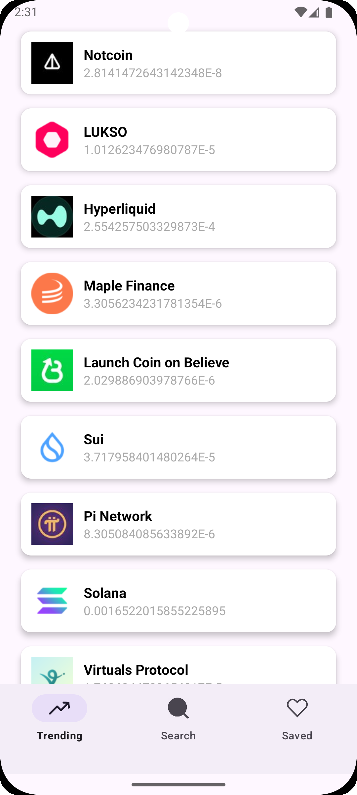
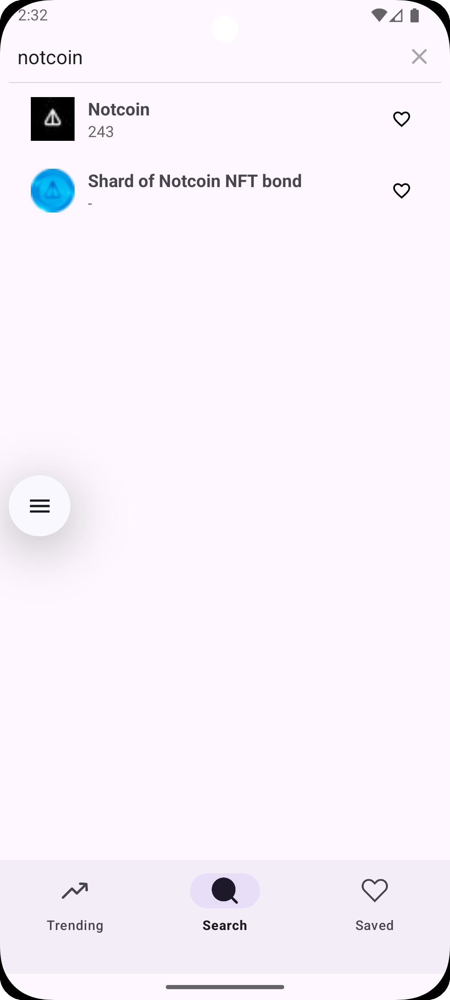
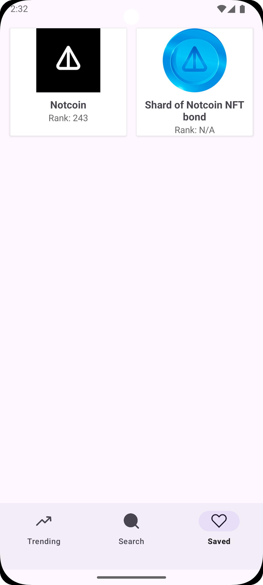

# 🪙 CryptoWatch – Real-Time Crypto Tracker (Android)

**CryptoWatch** is a cryptocurrency tracking Android application I built as a learning project to explore **clean architecture (MVVM)** with **Retrofit**, **RoomDB**, and **Hilt**. It fetches real-time crypto market data from the **[CoinGecko API](https://www.coingecko.com/en/api)** and allows users to browse trending coins, search for tokens, and save favorites locally.

The app is designed to be modular, responsive, and extensible – aiming to eventually support full portfolio tracking with simulated investments and chart visualizations.

---

## 🧠 Why I Built This

As an Android developer, I wanted to create something meaningful while solidifying my grasp on the following:
- **MVVM** architecture with proper separation of concerns
- **Retrofit** for REST API consumption
- **RoomDB** for local storage
- **Hilt** for dependency injection and testability
- **LiveData + ViewModel** lifecycle management
- **Jetpack Navigation** for fragment transitions

This project also introduced me to good UI practices using `RecyclerView`, `Glide` for image loading, and a scalable repo-pattern-based data layer.

---

## 🔧 Tech Stack

| Layer         | Tech                                 |
|---------------|--------------------------------------|
| Architecture  | MVVM + Repository Pattern            |
| UI            | Jetpack Compose XML + RecyclerViews  |
| Networking    | Retrofit + CoinGecko API             |
| Image Loading | Glide                                |
| Local Storage | Room Database (planned for watchlist)|
| DI            | Hilt                                 |
| Navigation    | Jetpack Navigation Component         |

---

## 📲 Features

- 🔥 **Trending Coins** – Fetched from `/search/trending` endpoint of CoinGecko.
- 🔍 **Search** – Search coins with live suggestions using `/search`.
- 💾 **Saved Coins** – Locally persist your favorite coins for quick access.
- 💡 Built with scalability in mind – the architecture supports easy extension (e.g., charts, portfolio features).

---

## ⚙️ CoinGecko API

This project uses the **free & public CoinGecko API**, which requires no authentication. You can find their full documentation here:  
📎 https://www.coingecko.com/en/api/documentation

Some of the endpoints I use:
- `GET /search/trending`
- `GET /search?query={query}`

---

## 🏗️ Project Structure

```

CryptoWatch/
├── data/
│   ├── retrofit/     # API models and service
│   └── db/           # Room entities & DAO (coming soon)
├── di/               # Hilt Module
├── repo/             # Repositories for Room and Retrofit
├── viewmodel/        # ViewModel classes
├── fragments/
│   ├── trending/
│   ├── search/
│   └── saved/
├── utils/            # RecyclerView adapters, UI helpers

````

---

## 📸 UI Screenshots

| Trending | Search | Saved |
|---------|--------|-------|
|  |  |  |

---

## 🛠️ How to Run

1. **Clone this repository**
   ```bash
   git clone https://github.com/your-username/CryptoWatch.git
````

2. **Open in Android Studio**

3. **Sync Gradle & run on emulator/device**

4. You're good to go! No API key needed – CoinGecko is mostly public.

---

## 🧪 What's Next?

* ✅ Trending, Search, and Saved features implemented
* 🧠 Coming Soon:

  * RoomDB-backed persistence
  * Portfolio simulator
  * Candlestick chart (MPAndroidChart)
  * Dark mode support
---

## 🙋‍♂️ About Me

I’m a passionate Android developer exploring modern app development techniques. This project is part of my journey into scalable architecture and clean code practices.
Feel free to reach out or fork the repo!

[🔗 GitHub Profile](https://github.com/mat-in)

